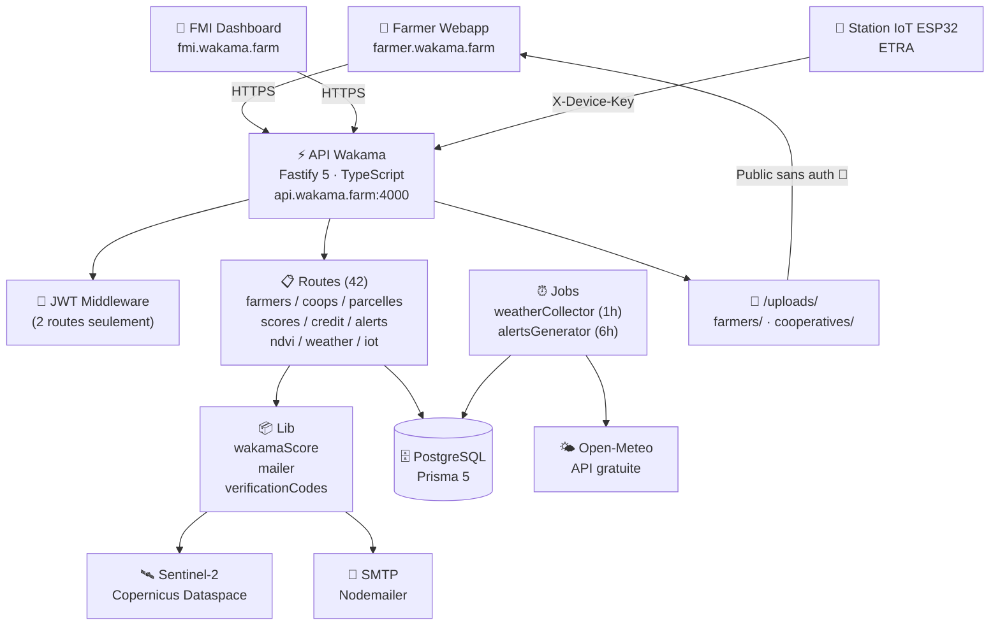
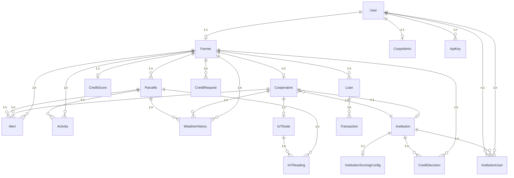
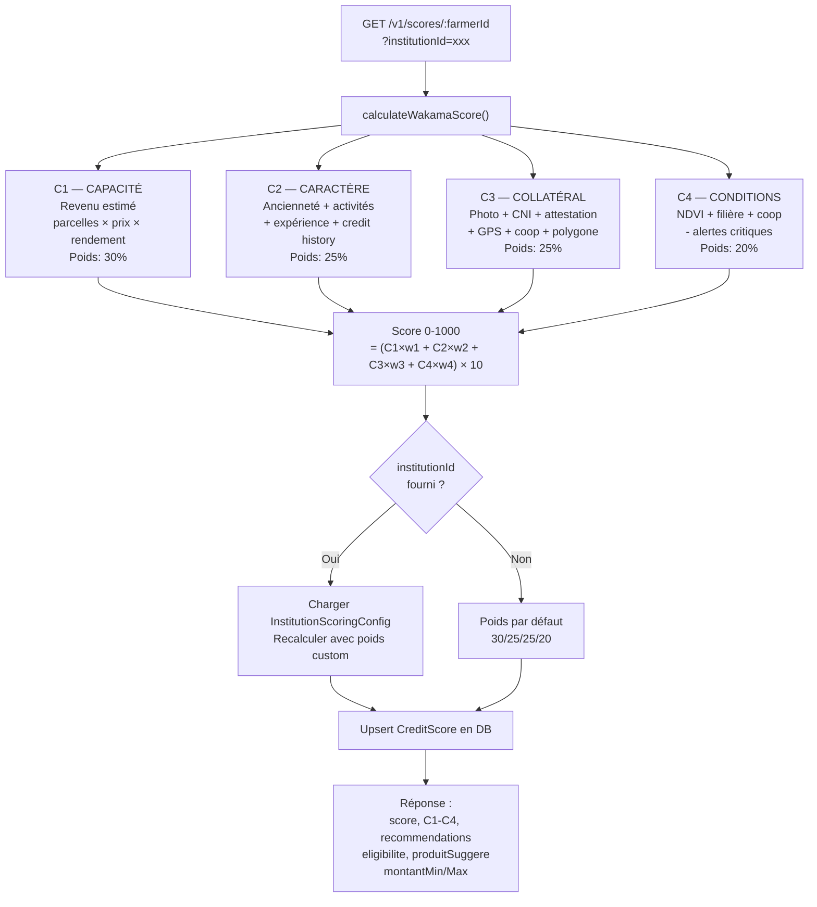
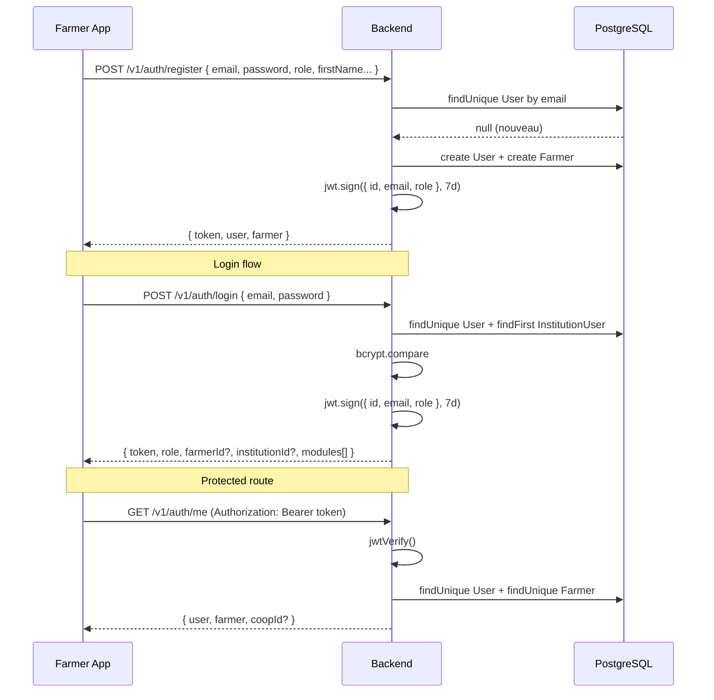

# BACKEND API AUDIT — Wakama Backend
> Audit réalisé le 2026-05-02 · Environnement : `https://api.wakama.farm`  
> Ce document est destiné au chef de produit, aux développeurs backend, frontend Farmer Webapp, FMI Dashboard et à tout assistant IA reprenant le projet.

---

## Table des matières

1. [Résumé exécutif](#1-résumé-exécutif)
2. [Stack technique détectée](#2-stack-technique-détectée)
3. [Architecture des dossiers](#3-architecture-des-dossiers)
4. [Point d'entrée serveur](#4-point-dentrée-serveur)
5. [Configuration environnement](#5-configuration-environnement)
6. [Authentification et rôles](#6-authentification-et-rôles)
7. [Routes API — tableau global](#7-routes-api--tableau-global)
8. [Modèles Prisma / base de données](#8-modèles-prisma--base-de-données)
9. [Relations principales entre modèles](#9-relations-principales-entre-modèles)
10. [Endpoints Farmers](#10-endpoints-farmers)
11. [Endpoints Cooperatives](#11-endpoints-cooperatives)
12. [Endpoints Institutions / FMI](#12-endpoints-institutions--fmi)
13. [Endpoints Parcelles](#13-endpoints-parcelles)
14. [Endpoints Scores / Wakama Score](#14-endpoints-scores--wakama-score)
15. [Endpoints Credit Requests](#15-endpoints-credit-requests)
16. [Endpoints Alerts](#16-endpoints-alerts)
17. [Endpoints NDVI](#17-endpoints-ndvi)
18. [Endpoints Weather](#18-endpoints-weather)
19. [Endpoints IoT](#19-endpoints-iot)
20. [Endpoints Uploads / fichiers](#20-endpoints-uploads--fichiers)
21. [Jobs / cron / tâches automatiques](#21-jobs--cron--tâches-automatiques)
22. [Sécurité / CORS / rate limit / validation](#22-sécurité--cors--rate-limit--validation)
23. [Gestion erreurs / logging](#23-gestion-erreurs--logging)
24. [État Swagger / documentation API](#24-état-swagger--documentation-api)
25. [Écarts backend vs Farmer Webapp](#25-écarts-backend-vs-farmer-webapp)
26. [Écarts backend vs FMI Dashboard](#26-écarts-backend-vs-fmi-dashboard)
27. [Ce qui manque pour un dossier comité complet](#27-ce-qui-manque-pour-un-dossier-comité-complet)
28. [Ce qui manque pour un scoring institutionnel explicable](#28-ce-qui-manque-pour-un-scoring-institutionnel-explicable)
29. [Ce qui manque pour audit trail / conformité](#29-ce-qui-manque-pour-audit-trail--conformité)
30. [Roadmap technique recommandée P0 / P1 / P2](#30-roadmap-technique-recommandée-p0--p1--p2)
31. [Annexes — Schémas Mermaid](#31-annexes--schémas-mermaid)

---

## 1. Résumé exécutif

Le backend Wakama est une API REST Fastify/TypeScript en production sur `https://api.wakama.farm`.  
Il couvre les domaines : authentification, gestion agriculteurs, coopératives, parcelles, scoring 4C, crédit, alertes, NDVI (Sentinel-2), météo (Open-Meteo), IoT (ESP32), uploads.

**Points forts détectés :**
- Stack moderne, typée, déployée et fonctionnelle
- Scoring 4C opérationnel avec personnalisation institutionnelle
- Collecte météo automatique toutes les heures
- Génération automatique d'alertes toutes les 6h
- Ingestion IoT ESP32 fonctionnelle (station ETRA)
- NDVI satellite via Copernicus Dataspace (Sentinel-2)

**Problèmes critiques (P0) — à corriger avant tout travail de synchronisation :**

| # | Problème | Risque |
|---|---------|--------|
| 🔴 1 | **Quasi-totalité des routes sans authentification** | Données personnelles accessibles publiquement, décisions crédit modifiables sans auth |
| 🔴 2 | **Documents KYC servis en fichiers statiques publics** | Fuite de CNI, attestations foncières |
| 🔴 3 | **Clé device IoT hardcodée dans le code source** | Ingestion falsifiée possible |
| 🔴 4 | **Codes de vérification email stockés en mémoire** | Perdus au redémarrage |
| 🔴 5 | **Aucun rate limiting ni validation payload** | Spam, injection, surcharge DB |
| 🟠 6 | Aucune isolation multi-tenant : toute institution voit tous les farmers | Violation confidentialité |
| 🟠 7 | Pas de version/audit trail sur le score | Non conforme audit institutionnel |
| 🟡 8 | Pas de Swagger/OpenAPI | Intégration fragile |
| 🟡 9 | Pas de tests | Régression non détectée |
| 🟡 10 | Pas de Docker/docker-compose documenté | Déploiement non reproductible |

---

## 2. Stack technique détectée

| Composant | Technologie | Version |
|-----------|-------------|---------|
| Langage | TypeScript | 5.9.x |
| Runtime | Node.js | ESM (`"type": "module"`) |
| Framework | **Fastify** | 5.8.x |
| ORM | **Prisma** | 5.22.x |
| Base de données | **PostgreSQL** | (via DATABASE_URL) |
| Auth | **@fastify/jwt** (JWT RS256/HS256) | 10.0.x |
| Upload | Local disk (`./uploads/`) | — |
| Email | **Nodemailer** (SMTP) | 8.0.x |
| NDVI | **Copernicus Dataspace** (Sentinel-2 L2A) | API v1 |
| Météo | **Open-Meteo** | API gratuite |
| IoT | Custom ESP32 via HTTP POST | — |
| Hash mot de passe | **bcryptjs** | 3.0.x |
| CORS | @fastify/cors (`origin: true`) | 11.2.x |
| Fichiers statiques | @fastify/static | 9.0.x |

**Scripts package.json :**
```
dev    → nodemon --exec 'node --loader ts-node/esm' src/index.ts
build  → tsc
start  → node dist/index.js
db:migrate → prisma migrate dev
db:studio  → prisma studio
db:generate → prisma generate
```

**Déploiement :**
- Port : `process.env.PORT || 4000`
- Host : `0.0.0.0` (toutes interfaces)
- TypeScript strict : **désactivé** (`"strict": false`)
- Aucun Dockerfile ou docker-compose détecté dans le repo
- Présumé déployé via **Coolify** sur VPS (basé sur le nom de domaine api.wakama.farm)

---

## 3. Architecture des dossiers

```
wakama-backend/
├── src/
│   ├── index.ts                 # Point d'entrée — bootstrap Fastify + jobs
│   ├── routes/                  # Handlers HTTP (routes + logique métier mélangées)
│   │   ├── auth.ts              # Auth : register, login, me
│   │   ├── farmers.ts           # CRUD farmers
│   │   ├── cooperatives.ts      # CRUD cooperatives
│   │   ├── institutions.ts      # Institutions, decisions, scoring-config
│   │   ├── parcelles.ts         # CRUD parcelles
│   │   ├── scores.ts            # Calcul et retour du Wakama Score
│   │   ├── creditRequests.ts    # Demandes de crédit + approve/reject
│   │   ├── alerts.ts            # Lecture et marquage alertes
│   │   ├── ndvi.ts              # NDVI via Sentinel-2
│   │   ├── weather.ts           # Historique météo
│   │   ├── iot.ts               # Ingestion IoT + lecture nodes/readings
│   │   ├── iotKitRequests.ts    # Demandes kit IoT
│   │   ├── activities.ts        # Activités agricoles
│   │   ├── messages.ts          # Messages farmer ↔ coop
│   │   └── upload.ts            # Upload photos/documents
│   ├── lib/
│   │   ├── prisma.ts            # Singleton PrismaClient
│   │   ├── wakamaScore.ts       # Moteur de scoring 4C (formule principale)
│   │   ├── mailer.ts            # Nodemailer — notifications email
│   │   └── verificationCodes.ts # Store en mémoire des codes OTP
│   ├── middleware/
│   │   └── auth.ts              # verifyToken (jwtVerify Fastify)
│   ├── jobs/
│   │   ├── weatherCollector.ts  # Collecte météo Open-Meteo (parcelles + coops)
│   │   └── alertsGenerator.ts   # Génération automatique alertes météo + NDVI + IoT
│   └── seeds/
│       ├── institutions.ts          # Seed 9 institutions (Baobab, REMUCI, NSIA…)
│       ├── createInstitutionUsers.ts # Seed users admin institution
│       └── linkEtraCoop.ts          # Lien station ETRA ↔ coop
├── prisma/
│   ├── schema.prisma            # Schéma Prisma (source de vérité DB)
│   └── migrations/              # 11 migrations depuis 20260322
├── generated/prisma/            # Client Prisma généré
├── uploads/
│   ├── farmers/                 # Photos et documents KYC farmers
│   └── cooperatives/            # Logos coopératives
├── dist/                        # Build TypeScript compilé
├── .env                         # DATABASE_URL, JWT_SECRET, PORT (valeurs masquées)
├── package.json
└── tsconfig.json
```

**Note architecture :** Il n'y a pas de séparation controllers/services. Toute la logique métier est directement dans les fichiers de routes. C'est acceptable pour la taille actuelle mais constituera une dette technique à mesure que le projet grandit.

---

## 4. Point d'entrée serveur

**Fichier :** `src/index.ts`

Séquence de démarrage :
1. `dotenv/config` chargé
2. Fastify instancié avec `logger: true`
3. Plugins enregistrés : CORS → JWT → multipart → staticFiles
4. Dossiers d'upload initialisés
5. Route `/health` enregistrée
6. 15 modules de routes enregistrés
7. `app.listen({ port, host: '0.0.0.0' })`
8. Après 30s : collecte météo initiale
9. Après 60s : génération alertes initiale
10. Boucle toutes les 60min : collecte météo
11. Boucle toutes les 6h : génération alertes

**Health check :**
```
GET /health → { status: 'ok', version: '1.0.0' }
```

---

## 5. Configuration environnement

Variables d'environnement lues par l'application (valeurs masquées) :

| Variable | Obligatoire | Valeur .env | Usage |
|----------|-------------|-------------|-------|
| `DATABASE_URL` | ✅ | `***MASKED***` | Connexion PostgreSQL (Prisma) |
| `JWT_SECRET` | ✅ | `***MASKED***` | Signature JWT |
| `PORT` | ❌ | `***MASKED***` | Port serveur (défaut : 4000) |
| `SMTP_HOST` | ✅ mailer | non présent dans .env | Hôte SMTP |
| `SMTP_PORT` | ✅ mailer | non présent dans .env | Port SMTP |
| `SMTP_USER` | ✅ mailer | non présent dans .env | Compte SMTP |
| `SMTP_PASS` | ✅ mailer | non présent dans .env | Mot de passe SMTP |
| `SENTINEL_CLIENT_ID` | ✅ NDVI | non présent dans .env | Copernicus Dataspace client ID |
| `SENTINEL_CLIENT_SECRET` | ✅ NDVI | non présent dans .env | Copernicus Dataspace secret |

**⚠️ Attention :** Le fichier `.env` du repo ne contient que `DATABASE_URL`, `JWT_SECRET` et `PORT`. Les variables SMTP et Sentinel ne sont pas dans ce `.env` — elles doivent être injectées autrement (variables d'environnement système, panneau Coolify, etc.).

---

## 6. Authentification et rôles

### Mécanisme

- **Bibliothèque :** `@fastify/jwt` (JWT HMAC HS256)
- **Secret :** `process.env.JWT_SECRET`
- **Durée :** `7 jours` (`expiresIn: '7d'`)
- **Stockage client :** `localStorage` (`wakama_token`)

### Payload JWT

```json
{
  "id": "cuid_user",
  "email": "user@example.com",
  "role": "FARMER | COOP_ADMIN | MFI_AGENT | SUPERADMIN | INSTITUTION_ADMIN",
  "iat": 1234567890,
  "exp": 1235172690
}
```

**⚠️ Le JWT ne contient pas `farmerId`, `coopId` ni `institutionId`.** Ces valeurs sont récupérées depuis la DB à chaque requête qui en a besoin.

### Rôles supportés (enum Prisma)

| Rôle | Description |
|------|-------------|
| `FARMER` | Agriculteur — accès à son profil et ses données |
| `COOP_ADMIN` | Administrateur de coopérative |
| `MFI_AGENT` | Agent IMF (micro-finance) |
| `SUPERADMIN` | Super administrateur Wakama |
| `INSTITUTION_ADMIN` | Administrateur d'une institution financière |

### Middleware auth

```typescript
// src/middleware/auth.ts
export async function verifyToken(request, reply) {
  try {
    await request.jwtVerify()
  } catch (err) {
    reply.status(401).send({ error: 'Unauthorized' })
  }
}
```

Utilisé via `{ preHandler: verifyToken }` sur les routes concernées.

### Routes protégées vs publiques

| Route | Auth | Rôle vérifié |
|-------|------|--------------|
| `GET /v1/auth/me` | ✅ JWT | Non vérifié |
| `POST /v1/cooperatives` | ✅ JWT | Non vérifié |
| **Toutes les autres routes** | ❌ PUBLIC | — |

**🔴 CRITIQUE : Quasi-toutes les routes sont publiques, y compris les routes sensibles (credit approve/reject, upload KYC, modification farmers).**

### Login institution dédié

`POST /v1/auth/institution-login` vérifie que le rôle est `INSTITUTION_ADMIN` et retourne `institutionId`, `institutionName`, `modules` en plus du token.

---

## 7. Routes API — tableau global

| Méthode | Route | Fichier | Auth | Rôle | DB |
|---------|-------|---------|------|------|-----|
| GET | `/health` | index.ts | Non | — | — |
| **Auth** | | | | | |
| POST | `/v1/auth/register` | auth.ts | Non | — | User, Farmer |
| POST | `/v1/auth/login` | auth.ts | Non | — | User, Farmer, InstitutionUser |
| POST | `/v1/auth/institution-login` | auth.ts | Non | INSTITUTION_ADMIN | User, InstitutionUser |
| GET | `/v1/auth/me` | auth.ts | **✅** | — | User, Farmer, Cooperative |
| POST | `/v1/auth/send-verification` | auth.ts | Non | — | User (check) |
| POST | `/v1/auth/verify-code` | auth.ts | Non | — | — (mémoire) |
| **Farmers** | | | | | |
| GET | `/v1/farmers` | farmers.ts | Non | — | Farmer |
| GET | `/v1/farmers/:id` | farmers.ts | Non | — | Farmer + relations |
| POST | `/v1/farmers` | farmers.ts | Non | — | Farmer |
| PATCH | `/v1/farmers/:id` | farmers.ts | Non | — | Farmer |
| **Cooperatives** | | | | | |
| GET | `/v1/cooperatives` | cooperatives.ts | Non | — | Cooperative |
| POST | `/v1/cooperatives` | cooperatives.ts | **✅** | — | Cooperative |
| GET | `/v1/cooperatives/:id` | cooperatives.ts | Non | — | Cooperative + count |
| PATCH | `/v1/cooperatives/:id` | cooperatives.ts | Non | — | Cooperative |
| **Parcelles** | | | | | |
| GET | `/v1/parcelles` | parcelles.ts | Non | — | Parcelle |
| POST | `/v1/parcelles` | parcelles.ts | Non | — | Parcelle |
| PATCH | `/v1/parcelles/:id` | parcelles.ts | Non | — | Parcelle |
| DELETE | `/v1/parcelles/:id` | parcelles.ts | Non | — | Parcelle |
| **Scores** | | | | | |
| GET | `/v1/scores/:farmerId` | scores.ts | Non | — | Farmer, Parcelle, Activity, Alert, InstitutionScoringConfig, CreditScore |
| GET | `/v1/scores/coop/:coopId` | scores.ts | Non | — | Farmer, Parcelle, Activity, Alert |
| **Alerts** | | | | | |
| GET | `/v1/alerts` | alerts.ts | Non | — | Alert |
| PATCH | `/v1/alerts/:id/read` | alerts.ts | Non | — | Alert |
| PATCH | `/v1/alerts/read-all` | alerts.ts | Non | — | Alert |
| **NDVI** | | | | | |
| GET | `/v1/ndvi/:parcelleId` | ndvi.ts | Non | — | Parcelle → Sentinel API |
| GET | `/v1/ndvi/parcelle/:parcelleId/image` | ndvi.ts | Non | — | Parcelle → Sentinel API |
| **Weather** | | | | | |
| GET | `/v1/weather/history/:parcelleId` | weather.ts | Non | — | WeatherHistory |
| GET | `/v1/weather/history/farmer/:farmerId` | weather.ts | Non | — | WeatherHistory |
| **IoT** | | | | | |
| POST | `/v1/iot/ingest` | iot.ts | X-Device-Key | — | IoTNode, IoTReading, WeatherHistory |
| GET | `/v1/iot/node` | iot.ts | Non | — | IoTNode + IoTReading |
| GET | `/v1/iot/readings/:nodeId` | iot.ts | Non | — | IoTReading |
| **Credit Requests** | | | | | |
| POST | `/v1/credit-requests` | creditRequests.ts | Non | — | CreditRequest |
| GET | `/v1/credit-requests` | creditRequests.ts | Non | — | CreditRequest |
| PATCH | `/v1/credit-requests/:id/approve` | creditRequests.ts | Non | — | CreditRequest, CreditDecision |
| PATCH | `/v1/credit-requests/:id/reject` | creditRequests.ts | Non | — | CreditRequest |
| **Institutions** | | | | | |
| GET | `/v1/institutions` | institutions.ts | Non | — | Institution |
| GET | `/v1/institutions/:id` | institutions.ts | Non | — | Institution |
| POST | `/v1/institutions` | institutions.ts | Non | — | Institution |
| GET | `/v1/institutions/:id/users` | institutions.ts | Non | — | InstitutionUser |
| POST | `/v1/institutions/:id/decisions` | institutions.ts | Non | — | CreditDecision |
| GET | `/v1/institutions/:id/decisions` | institutions.ts | Non | — | CreditDecision |
| PATCH | `/v1/institutions/decisions/:id` | institutions.ts | Non | — | CreditDecision |
| GET | `/v1/institutions/:id/scoring-config` | institutions.ts | Non | — | InstitutionScoringConfig |
| PATCH | `/v1/institutions/:id/scoring-config` | institutions.ts | Non | — | InstitutionScoringConfig |
| **Activities** | | | | | |
| POST | `/v1/activities` | activities.ts | Non | — | Activity |
| GET | `/v1/activities` | activities.ts | Non | — | Activity |
| **Messages** | | | | | |
| POST | `/v1/messages` | messages.ts | Non | — | Message |
| GET | `/v1/messages` | messages.ts | Non | — | Message |
| **Upload** | | | | | |
| POST | `/v1/upload/farmer/:farmerId/photo` | upload.ts | Non | — | Farmer (photoUrl) |
| POST | `/v1/upload/farmer/:farmerId/document` | upload.ts | Non | — | Disk seulement |
| POST | `/v1/upload/cooperative/:coopId/logo` | upload.ts | Non | — | Disk seulement |
| **IoT Kit** | | | | | |
| POST | `/v1/iot-kit-requests` | iotKitRequests.ts | Non | — | IotKitRequest |
| **Fichiers statiques** | | | | | |
| GET | `/uploads/*` | @fastify/static | Non | — | Disk |

**Total : 42 routes**  
**Routes protégées par JWT : 2 sur 42**

---

## 8. Modèles Prisma / base de données

### User
- **Rôle :** Compte authentification
- **Champs clés :** `id` (cuid), `email` (unique), `passwordHash`, `role`
- **Relations :** → Farmer (1:1), CoopAdmin (1:1), MFIAgent (1:1), ApiKey (1:n), InstitutionUser (1:n)
- **Notes :** Modèle pivot, pas de données personnelles directes

### Farmer
- **Rôle :** Profil agriculteur principal
- **Champs clés :** `firstName`, `lastName`, `phone`, `region`, `village`, `lat/lng`, `surface`, `kycStatus`, `photoUrl`, `cniUrl`, `attestationUrl`, `cooperativeId`, `blockchainId`
- **Scoring :** `experienceAnnees` (String), `revenusAnnexes` (String), `historicCredit` (String)
- **Relations :** → User (1:1), Cooperative (n:1), Parcelle (1:n), Loan (1:n), Alert (1:n), CreditScore (1:1), IoTNode (1:n), WeatherHistory (1:n), Activity (1:n), Message (1:n), CreditRequest (1:n), CreditDecision (1:n)
- **⚠️ Données sensibles :** photoUrl, cniUrl, attestationUrl (fichiers KYC potentiellement publics)

### Cooperative
- **Rôle :** Coopérative agricole
- **Champs clés :** `name`, `rccm` (unique), `region`, `filiere`, `surface`, `foundedAt`, `lat/lng`, `logoUrl`, `adminUserId`, `institutionId`
- **Relations :** → Institution (n:1), Farmer (1:n), CoopAdmin (1:1?), IoTNode (1:1), Alert (1:n), WeatherHistory (1:n), Message (1:n)
- **⚠️ Remarque :** `adminUserId` est un champ String optionnel (pas une FK Prisma), différent du modèle `CoopAdmin` qui lui est une vraie relation

### Parcelle
- **Rôle :** Parcelle/champ d'un agriculteur
- **Champs clés :** `farmerId`, `name`, `culture`, `superficie`, `lat/lng`, `ndvi`, `statut`, `polygone` (JSON string GeoJSON), `stade`, `datePlantation`, `historique`
- **Relations :** → Farmer (n:1), Alert (1:n), IoTReading (1:n), WeatherHistory (1:n), Activity (1:n)

### CreditScore
- **Rôle :** Snapshot du score Wakama (mis à jour à chaque calcul)
- **Champs clés :** `farmerId` (unique), `score` (0-1000), `scoreMax`, `status`, `riskLevel`, `historiquePayments`, `utilisationCredit`, `diversificationCultures`, `regulariteDeclarations`, `generatedAt`
- **⚠️ Pas de versioning :** un seul enregistrement par farmer, écrasé à chaque calcul

### Loan
- **Rôle :** Prêt accordé
- **Champs clés :** `farmerId`, `type`, `montantInitial`, `montantRembourse`, `tauxAnnuel`, `status` (EN_COURS/REMBOURSE/DEFAUT/EN_ATTENTE), `nextPaymentDate`, `nextPaymentAmount`
- **Relations :** → Farmer (n:1), Transaction (1:n)
- **⚠️ Note :** Pas d'endpoint CRUD Loan dans les routes — modèle créé mais non exposé via API

### Transaction
- **Rôle :** Mouvement financier sur un prêt
- **Champs clés :** `loanId`, `date`, `description`, `amount`, `isCredit`
- **⚠️ Note :** Aucun endpoint exposé

### Alert
- **Rôle :** Alerte générée automatiquement ou manuellement
- **Champs clés :** `farmerId?`, `coopId?`, `parcelleId?`, `type` (METEO/NDVI/IOT), `severity` (WARNING/CRITICAL), `title`, `message`, `read`, `createdAt`

### IoTNode
- **Rôle :** Nœud capteur IoT (station ETRA)
- **Champs clés :** `nodeCode` (unique), `cooperativeId?`, `farmerId?`, `lat/lng`, `status` (LIVE/OFFLINE/MAINTENANCE), `batterie`, `connectivity`, `lastSyncAt`, `siteId`, `subteamId`, `altitude`, `lastRssi`, `totalReadings`

### IoTReading
- **Rôle :** Lecture capteur IoT
- **Champs clés :** `nodeId`, `parcelleId?`, `temperature`, `humidity`, `soilMoisture?`, `rainfall?`, + capteurs DHT22 x2, DS18B20, analogiques sol + métadonnées device

### ApiKey
- **Rôle :** Clés API programmatiques
- **Champs clés :** `name`, `key` (unique), `permissions[]`, `status`, `userId`
- **⚠️ Note :** Modèle défini mais **aucun endpoint CRUD ApiKey** dans les routes

### WeatherHistory
- **Rôle :** Historique météo collecté automatiquement
- **Champs clés :** `parcelleId?`, `coopId?`, `farmerId?`, `lat/lng`, `region`, `country`, température air/sol (0-54cm), humidité sol (0-27cm), précipitations, vent, radiation solaire, UV, ET0, VPD, rosée

### Activity
- **Rôle :** Activité agricole déclarée
- **Champs clés :** `farmerId`, `parcelleId?`, `type`, `description?`, `date`, `statut`

### IotKitRequest
- **Rôle :** Demande de kit IoT par une coopérative
- **Champs clés :** `coopId?`, `coopName`, `superficie?`, `culture?`, `nbMembres?`, `hasElectricite`, `hasConnexion`, `message?`, `statut`

### CreditRequest
- **Rôle :** Demande de crédit soumise par un farmer
- **Champs clés :** `farmerId`, `coopId?`, `montant`, `duree`, `objet`, `message?`, `statut` (EN_ATTENTE/APPROUVE/REJETE), `montantAccorde?`, `taux?`, `dureeAccordee?`, `motif?`

### Institution
- **Rôle :** Institution financière partenaire (IMF, banque, assurance)
- **Champs clés :** `name`, `type` (MFI/BANQUE/ASSURANCE), `country`, `logo?`, `modules[]`, `plan` (STANDARD/PRO), `active`
- **Seeds :** Baobab CI, UNACOOPEC-CI, REMUCI, Advans CI, NSIA Banque, Ecobank CI, Atlantique Assurances, AXA CI, Wakama Demo

### InstitutionUser
- **Rôle :** Lien entre un User et une Institution
- **Champs clés :** `userId`, `institutionId`, `role` (défaut: "ANALYST")
- **Contrainte unique :** `[userId, institutionId]`

### CreditDecision
- **Rôle :** Décision institutionnelle sur une demande de crédit
- **Champs clés :** `institutionId`, `farmerId`, `montant?`, `taux?`, `duree?`, `statut`, `motif?`, `notes?`

### InstitutionScoringConfig
- **Rôle :** Configuration personnalisée du scoring par institution
- **Champs clés :** `weightC1` (30), `weightC2` (25), `weightC3` (25), `weightC4` (20), `c1Rules?`, `c2Rules?`, `c3Rules?`, `c4Rules?`, `products?`, `creditConditions?`, `riskProfile?`

### Message
- **Rôle :** Message d'un farmer vers sa coopérative
- **Champs clés :** `farmerId`, `cooperativeId`, `objet`, `message`, `lu`

---

## 9. Relations principales entre modèles

```
User (1) ──────── (1) Farmer
User (1) ──────── (1) CoopAdmin  ──── (1) Cooperative
User (1) ──────── (n) InstitutionUser ── (n) Institution
User (1) ──────── (n) ApiKey [NON EXPOSÉ]

Farmer (1) ──────── (n) Parcelle
Farmer (1) ──────── (1) CreditScore [snapshot]
Farmer (1) ──────── (n) Loan  ──── (n) Transaction
Farmer (1) ──────── (n) Alert
Farmer (1) ──────── (n) Activity
Farmer (1) ──────── (n) CreditRequest
Farmer (1) ──────── (n) CreditDecision
Farmer (1) ──────── (n) IoTNode
Farmer (1) ──────── (n) WeatherHistory
Farmer (1) ──────── (n) Message → Cooperative

Cooperative (n) ── (1) Institution
Cooperative (1) ── (1) IoTNode
Cooperative (1) ── (n) Alert
Cooperative (1) ── (n) WeatherHistory
Cooperative (1) ── (n) Message

Parcelle (1) ──── (n) Alert
Parcelle (1) ──── (n) IoTReading ← IoTNode
Parcelle (1) ──── (n) WeatherHistory
Parcelle (1) ──── (n) Activity

Institution (1) ── (n) CreditDecision
Institution (1) ── (1) InstitutionScoringConfig
Institution (1) ── (n) Cooperative [institutionId]
```

---

## 10. Endpoints Farmers

| Endpoint | Auth | Paramètres | Réponse | Statut |
|----------|------|-----------|---------|--------|
| `GET /v1/farmers` | ❌ PUBLIC | `?page, limit, search, region, cooperativeId` | `{ data[], total, page, pageSize }` | ✅ Complet |
| `GET /v1/farmers/:id` | ❌ PUBLIC | — | Farmer + parcelles + creditScore + loans + 5 alerts + cooperative | ✅ Complet |
| `POST /v1/farmers` | ❌ PUBLIC | `{ firstName, lastName, phone, region, village, lat, lng, surface, cooperativeId, userId }` | Farmer créé | ⚠️ Pas d'auth |
| `PATCH /v1/farmers/:id` | ❌ PUBLIC | Champs optionnels farmer + scoring fields | Farmer mis à jour | ⚠️ Pas d'auth |

**Manquant :**
- `DELETE /v1/farmers/:id` — pas d'endpoint de suppression
- `GET /v1/farmers/:id/activities` — activités d'un farmer (accès via query param)
- `GET /v1/farmers/:id/loans` — prêts d'un farmer (aucun endpoint loans)
- `PATCH /v1/farmers/:id/kyc` — validation KYC par institution

---

## 11. Endpoints Cooperatives

| Endpoint | Auth | Paramètres | Réponse | Statut |
|----------|------|-----------|---------|--------|
| `GET /v1/cooperatives` | ❌ PUBLIC | `?page, limit` | `{ data[], total, page, pageSize }` | ⚠️ Pas de filtre search/region/filiere |
| `POST /v1/cooperatives` | ✅ JWT | `{ name, rccm, region, filiere, surface, foundedAt, lat, lng }` | Cooperative créée | ✅ |
| `GET /v1/cooperatives/:id` | ❌ PUBLIC | — | Cooperative + membersCount + iotNode + institution | ✅ |
| `PATCH /v1/cooperatives/:id` | ❌ PUBLIC | Champs optionnels + institutionId | Cooperative mise à jour | ⚠️ Pas d'auth |

**Manquant :**
- `GET /v1/cooperatives/:id/members` — liste des membres d'une coop (workaround via `GET /v1/farmers?cooperativeId=xxx`)
- `DELETE /v1/cooperatives/:id`
- `GET /v1/cooperatives` filtre par `region`, `filiere`, `institutionId`
- `POST /v1/cooperatives/:id/members/:farmerId` — ajout d'un membre
- `DELETE /v1/cooperatives/:id/members/:farmerId` — retrait d'un membre
- Upload document coop (hors logo) — requis par Farmer Webapp mais absent du backend

---

## 12. Endpoints Institutions / FMI

| Endpoint | Auth | Paramètres | Réponse | Statut |
|----------|------|-----------|---------|--------|
| `GET /v1/institutions` | ❌ PUBLIC | — | Institution[] | ⚠️ Devrait être protégé |
| `GET /v1/institutions/:id` | ❌ PUBLIC | — | Institution | ⚠️ |
| `POST /v1/institutions` | ❌ PUBLIC | `{ name, type, country, logo, modules, plan }` | Institution | ⚠️ Devrait être SUPERADMIN |
| `GET /v1/institutions/:id/users` | ❌ PUBLIC | — | InstitutionUser[] | ⚠️ |
| `POST /v1/institutions/:id/decisions` | ❌ PUBLIC | `{ farmerId, montant, taux, duree, statut, motif, notes }` | CreditDecision | 🔴 Critique |
| `GET /v1/institutions/:id/decisions` | ❌ PUBLIC | — | CreditDecision[] | ⚠️ |
| `PATCH /v1/institutions/decisions/:id` | ❌ PUBLIC | Champs optionnels | CreditDecision | 🔴 Critique |
| `GET /v1/institutions/:id/scoring-config` | ❌ PUBLIC | — | Config ou défauts | ✅ logique |
| `PATCH /v1/institutions/:id/scoring-config` | ❌ PUBLIC | Poids C1-C4 + règles JSON | Config upsertée | ⚠️ Devrait être INSTITUTION_ADMIN |

**Manquant :**
- `GET /v1/institutions/:id/farmers` — liste des farmers liés à une institution (via leurs coops)
- Filtre `institutionId` sur `GET /v1/farmers` pour isolation multi-tenant
- `GET /v1/institutions/:id/credit-requests` — toutes les demandes de crédit pour une institution
- `GET /v1/institutions/:id/analytics` — KPIs portfolio (taux d'éligibilité, montant moyen, risque)
- Export CSV/PDF des décisions
- Audit trail des décisions

---

## 13. Endpoints Parcelles

| Endpoint | Auth | Paramètres | Réponse | Statut |
|----------|------|-----------|---------|--------|
| `GET /v1/parcelles` | ❌ PUBLIC | `?farmerId` | Parcelle[] | ✅ (avec filter) |
| `POST /v1/parcelles` | ❌ PUBLIC | `{ farmerId, name, culture, superficie, lat, lng, polygone?, ndvi? }` | Parcelle créée | ✅ logique |
| `PATCH /v1/parcelles/:id` | ❌ PUBLIC | Champs optionnels + polygone + ndvi + statut | Parcelle mise à jour | ✅ |
| `DELETE /v1/parcelles/:id` | ❌ PUBLIC | — | 204 No Content | ✅ |

**Note :** Le polygone est stocké comme `String` (JSON GeoJSON stringifié) — pas de type PostGIS.

**Manquant :**
- `GET /v1/parcelles/:id` — détail d'une parcelle par ID
- `GET /v1/parcelles/:id/weather` — météo d'une parcelle (routage indirect possible)
- `PATCH /v1/parcelles/:id/stage` — mise à jour stade phénologique uniquement
- Validation du format GeoJSON du polygone

---

## 14. Endpoints Scores / Wakama Score

### Moteur de scoring — `src/lib/wakamaScore.ts`

Le Wakama Score est calculé sur **une échelle 0-1000**, structuré en **4 dimensions** (les "4C") :

#### C1 — CAPACITÉ (poids défaut : 30%)
Revenus estimés à partir des parcelles :
```
revenuEstime = Σ(superficie × rendement_moyen × prix_marché)
```
| Seuil revenu | Score C1 |
|-------------|---------|
| ≥ 5 000 000 FCFA | 100 |
| ≥ 3 000 000 FCFA | 80 |
| ≥ 1 000 000 FCFA | 60 |
| ≥ 500 000 FCFA | 40 |
| > 0 | 20 |
| 0 | 0 |

Prix marché codés en dur pour 20 cultures (Cacao 1800/kg, Anacarde 315/kg, etc.)

#### C2 — CARACTÈRE (poids défaut : 25%)
```
scoreC2 = ancienneteScore + activitesScore + experienceScore + creditBonus
```
- `ancienneteScore` : 5-40pts selon mois depuis inscription (5=0-1m, 40=≥24m)
- `activitesScore` : 0-40pts selon nb activités déclarées
- `experienceScore` : 2-20pts selon `farmer.experienceAnnees` (string libre)
- `creditBonus` : -10 à +10 selon `farmer.historicCredit` (string libre)

#### C3 — COLLATÉRAL (poids défaut : 25%)
| Condition | Points |
|-----------|--------|
| Photo uploadée | +10 |
| CNI uploadée | +25 |
| Attestation foncière | +30 |
| GPS défini (lat/lng ≠ 0) | +10 |
| Membre d'une coopérative | +15 |
| Polygone parcelle défini | +10 |
| **Maximum** | **100** |

#### C4 — CONDITIONS (poids défaut : 20%)
```
scoreC4 = ndviScore + filiereScore + coopBonus - alertesMalus
```
- `ndviScore` : 0-40pts selon NDVI moyen des parcelles
- `filiereScore` : 30-50% selon filière (rente=100%, céréales=80%, vivrier=70%, maraicher=60%)
- `coopBonus` : 20pts si coop certifiée, 10pts si simple membre
- `alertesMalus` : -5pts par alerte CRITICAL non lue (max -20)

#### Score final et persistance
```
score = round((C1×pC1 + C2×pC2 + C3×pC3 + C4×pC4) × 10)
```
Le score est **sauvegardé dans CreditScore** (upsert) à chaque appel GET.

#### Eligibilité produits
| Produit | Score min |
|---------|----------|
| REMUCI Crédit Agricole | 300 |
| Baobab Agri Production | 400 |
| Baobab Agri Campagne | 600 |
| NSIA Pack Paysan | 700 |

#### Montant suggéré
```
capaciteRemboursement = revenuEstime × 0.35 × (score / 1000)
montantMin = max(100 000, capaciteRemboursement × 0.3)
montantMax = min(20 000 000, capaciteRemboursement)
```

### Routes scores

| Endpoint | Auth | Paramètres | Réponse | Statut |
|----------|------|-----------|---------|--------|
| `GET /v1/scores/:farmerId` | ❌ PUBLIC | `?institutionId` | WakamaScoreResult + eligibilite + produitSuggere + montants + recommendations | ✅ Fonctionnel |
| `GET /v1/scores/coop/:coopId` | ❌ PUBLIC | — | Portfolio coop : avgScore, eligible, eligibiliteRate, farmers[] | ✅ Fonctionnel |

**⚠️ Problèmes scoring identifiés :**
- `experienceAnnees` et `historicCredit` sont des strings libres : le parsing est fragile (`hc.includes('correctement')`)
- `coopCertifiee` recherche un champ `certification` qui n'existe pas dans le modèle Cooperative actuel — toujours `false`
- Pas de version du modèle de scoring dans le résultat
- Pas de niveau de confiance
- Pas d'audit trail (qui a demandé le calcul, quand, avec quelles données)
- Le score sauvegardé en DB (`CreditScore`) ne contient pas les 4 dimensions C1-C4 individuelles avec leurs explications détaillées

---

## 15. Endpoints Credit Requests

| Endpoint | Auth | Paramètres | Réponse | Statut |
|----------|------|-----------|---------|--------|
| `POST /v1/credit-requests` | ❌ PUBLIC | `{ farmerId, montant, duree, objet, message? }` | CreditRequest créée | ✅ |
| `GET /v1/credit-requests` | ❌ PUBLIC | `?farmerId` | CreditRequest[] | ⚠️ Pas de filtre institution |
| `PATCH /v1/credit-requests/:id/approve` | ❌ PUBLIC | `{ montant?, taux?, duree?, motif?, institutionId? }` | CreditRequest + CreditDecision | 🔴 Critique sans auth |
| `PATCH /v1/credit-requests/:id/reject` | ❌ PUBLIC | `{ motif? }` | CreditRequest | 🔴 Critique sans auth |

**Manquant :**
- `GET /v1/credit-requests` global sans filtre farmerId pour dashboard FMI
- `GET /v1/credit-requests/:id` — détail d'une demande
- Filtre par statut : `?statut=EN_ATTENTE`
- Filtre par institutionId (isolation multi-tenant)
- Notification email au farmer lors d'approbation/rejet

---

## 16. Endpoints Alerts

| Endpoint | Auth | Paramètres | Réponse | Statut |
|----------|------|-----------|---------|--------|
| `GET /v1/alerts` | ❌ PUBLIC | `?farmerId, coopId, unreadOnly` | Alert[] (max 50) | ✅ |
| `PATCH /v1/alerts/:id/read` | ❌ PUBLIC | — | Alert mise à jour | ✅ |
| `PATCH /v1/alerts/read-all` | ❌ PUBLIC | `{ farmerId?, coopId? }` | `{ success: true }` | ✅ |

**Manquant :**
- `POST /v1/alerts` — création manuelle d'une alerte (par institution ou admin)
- `PATCH /v1/alerts/:id/resolve` — résolution d'une alerte
- `GET /v1/alerts` filtre par `parcelleId`, `type`, `severity`
- Pagination des alertes (max 50 hardcodé)
- Alertes pour les institutions (filtre institutionId)

---

## 17. Endpoints NDVI

| Endpoint | Auth | Paramètres | Réponse | Statut |
|----------|------|-----------|---------|--------|
| `GET /v1/ndvi/:parcelleId` | ❌ PUBLIC | — | `{ parcelleId, ndvi, lastUpdated, status }` | ✅ Fonctionnel (si polygon défini) |
| `GET /v1/ndvi/parcelle/:parcelleId/image` | ❌ PUBLIC | — | PNG 512×512 (NDVI colorisé) | ✅ Fonctionnel |

**Logique NDVI :**
- Source : Sentinel-2 L2A via Copernicus Dataspace Statistics API
- Période : 90 derniers jours, agrégation P30D
- Résolution : 10m × 10m
- Le NDVI est mis à jour dans `Parcelle.ndvi` après chaque appel
- Authentification : client_credentials OAuth2 (SENTINEL_CLIENT_ID/SECRET)

**Manquant :**
- Historique NDVI (pas de table dédiée, seulement la valeur courante)
- NDVI sans polygon → erreur 400 (pas de fallback par point GPS)
- Cache NDVI (chaque appel refait une requête Sentinel)
- `GET /v1/ndvi/coop/:coopId` — NDVI moyen portfolio

---

## 18. Endpoints Weather

| Endpoint | Auth | Paramètres | Réponse | Statut |
|----------|------|-----------|---------|--------|
| `GET /v1/weather/history/:parcelleId` | ❌ PUBLIC | `?days=7` | WeatherHistory[] | ✅ |
| `GET /v1/weather/history/farmer/:farmerId` | ❌ PUBLIC | `?days=7` | WeatherHistory[] | ✅ |

**Collecte automatique :**
- Source : Open-Meteo (gratuit, sans clé API)
- Variables : 25+ variables dont température air/sol à 4 profondeurs, humidité sol à 5 profondeurs, précipitations, vent, radiation, UV, ET0, VPD
- Fréquence : toutes les heures
- Portée : toutes les parcelles + toutes les coops

**Manquant :**
- `GET /v1/weather/history/coop/:coopId`
- `GET /v1/weather/forecast/:lat/:lng` — prévisions directes
- Déduplication : potentielle accumulation massive de données si nombreuses parcelles
- Pas de TTL ni de nettoyage des anciennes données

---

## 19. Endpoints IoT

| Endpoint | Auth | Paramètres | Réponse | Statut |
|----------|------|-----------|---------|--------|
| `POST /v1/iot/ingest` | X-Device-Key header | Corps JSON ETRA | `{ ok, nodeId, message, ts }` | ✅ Fonctionnel |
| `GET /v1/iot/node` | ❌ PUBLIC | `?coopId, farmerId` | IoTNode + 50 dernières lectures | ✅ |
| `GET /v1/iot/readings/:nodeId` | ❌ PUBLIC | `?limit=50` | IoTReading[] | ✅ |

**Logique ingestion IoT :**
- Auth : header `X-Device-Key` vérifié contre `VALID_DEVICE_KEYS` (map hardcodée)
- Création automatique du nœud si inexistant
- Double stockage : IoTReading + WeatherHistory (pour ML training)
- Coordonnées hardcodées : `lat: 7.4882, lng: 4.8133` (Vallée du Bandama)

**🔴 Problèmes critiques :**
- Clé device `etra_esp32_001__K2v9F6pQxW3dR8nH1sL4aT7yU0iO5pB` **hardcodée dans le code source**
- Coordonnées du nœud ETRA hardcodées
- Aucune gestion des nouveaux devices (nécessite modification du code)
- `cooperativeId: 'coop-etra-001'` hardcodé — doit correspondre à un ID réel en DB

**Manquant :**
- CRUD IoTNode (création/modification via API)
- `PATCH /v1/iot/node/:id` — mise à jour statut/batterie
- Validation du timestamp `ts` (anti-replay)

---

## 20. Endpoints Uploads / fichiers

| Endpoint | Auth | Paramètres | Stockage | Réponse | Statut |
|----------|------|-----------|---------|---------|--------|
| `POST /v1/upload/farmer/:farmerId/photo` | ❌ PUBLIC | multipart/form-data `file` | `uploads/farmers/:farmerId/photo.ext` | `{ url }` + mise à jour `photoUrl` | ✅ |
| `POST /v1/upload/farmer/:farmerId/document` | ❌ PUBLIC | multipart/form-data `file` + `?type=cni\|attestation` | `uploads/farmers/:farmerId/:type.ext` | `{ url }` (pas de mise à jour DB) | ⚠️ |
| `POST /v1/upload/cooperative/:coopId/logo` | ❌ PUBLIC | multipart/form-data `file` | `uploads/cooperatives/:coopId/logo.ext` | `{ url }` (pas de mise à jour DB) | ⚠️ |

**Fichiers statiques :**
- Servis via `@fastify/static` sous `/uploads/*`
- **🔴 Accessible publiquement sans authentification**
- Inclut les documents KYC (CNI, attestations foncières)

**🔴 Problèmes sécurité uploads :**
1. Aucune validation d'extension de fichier
2. Aucune limite de taille de fichier
3. Aucune authentification requise
4. Documents KYC potentiellement accessibles publiquement via URL directe
5. `uploadCooperativeDocument` (endpoint `/v1/upload/cooperative/:coopId/document`) **appelé par Farmer Webapp mais absent du backend** — seul le logo est géré

**Manquant :**
- Validation extensions (whitelist : jpg/png/pdf)
- Limite taille fichier (ex. 10MB)
- Auth sur uploads
- Endpoint génération d'URL signée pour accès sécurisé aux documents KYC
- `POST /v1/upload/cooperative/:coopId/document` (manquant)
- Mise à jour automatique de `cniUrl` et `attestationUrl` dans Farmer après upload document

---

## 21. Jobs / cron / tâches automatiques

| Job | Fichier | Fréquence | Déclenchement | Description |
|-----|---------|-----------|---------------|-------------|
| `collectWeatherForAllParcelles` | jobs/weatherCollector.ts | Toutes les heures | Startup+30s puis setInterval | Appelle Open-Meteo pour chaque parcelle avec lat/lng valides |
| `collectWeatherForAllCoops` | jobs/weatherCollector.ts | Toutes les heures | Startup+30s puis setInterval | Appelle Open-Meteo pour chaque coop |
| `generateAlertsForAllFarmers` | jobs/alertsGenerator.ts | Toutes les 6h | Startup+60s puis setInterval | Génère alertes météo (pluie >20mm, sécheresse <0.15, chaleur >38°) + alertes NDVI (<0.2 CRITICAL, <0.3 WARNING) |
| `generateAlertsForCoops` | jobs/alertsGenerator.ts | Toutes les 6h | Startup+60s puis setInterval | Génère alertes IoT (soilMoisture <0.2, température >38°) |

**Seeds (exécution manuelle) :**
- `src/seeds/institutions.ts` — Crée les 9 institutions partenaires
- `src/seeds/createInstitutionUsers.ts` — Crée les comptes admin institution
- `src/seeds/linkEtraCoop.ts` — Lie la station ETRA à sa coopérative

**⚠️ Problèmes jobs :**
- Pas de protection anti-duplication si le serveur redémarre fréquemment (vérification `createdAt >= todayMidnight` mais seulement pour certaines alertes)
- Alerte température IoT (`generateAlertsForCoops`) : pas de vérification d'existence avant création → **crée des doublons potentiels**
- Pas de monitoring/alerting si un job échoue silencieusement
- Charge potentielle : si 1000 parcelles × 1 appel Open-Meteo/h = 1000 requêtes/h avec délai 100ms entre chaque = ~1min40s par cycle

---

## 22. Sécurité / CORS / rate limit / validation

### CORS
```typescript
origin: true,  // Tous les origins acceptés
methods: ['GET', 'POST', 'PATCH', 'PUT', 'DELETE', 'OPTIONS'],
allowedHeaders: ['Content-Type', 'Authorization'],
credentials: true,
```
**⚠️ `origin: true` = tous les domaines acceptés. En production, restreindre aux domaines Wakama.**

### Helmet
**❌ Absent.** Aucun plugin `@fastify/helmet` ni équivalent. Headers de sécurité (CSP, HSTS, X-Frame-Options, etc.) non configurés.

### Rate limiting
**❌ Absent.** Aucun `@fastify/rate-limit` ou équivalent. L'API peut être abusée sans limitation.

### Validation payload
**❌ Absent.** Les corps de requêtes sont castés directement (`request.body as { ... }`). Pas de validation avec Zod, Joi, ou le système de schéma Fastify. TypeScript strict **désactivé**.

### Authentification
- **2 routes sur 42** ont `verifyToken` comme preHandler
- **🔴 40 routes publiques**, incluant des opérations critiques

### Clé JWT
- Secret chargé depuis `process.env.JWT_SECRET`
- Expiration 7 jours
- Pas de refresh token, pas de révocation

### Upload sécurité
- Aucune validation d'extension
- Aucune limite de taille
- Documents KYC publics via `/uploads/*`

### IoT sécurité
- Clé device hardcodée dans le code source (`src/routes/iot.ts`)
- Format : `nodeCode__secretKey`

### Codes OTP
- Stockés en mémoire (`Map`) — perdus au redémarrage du serveur
- Expiration 15 minutes (correct)

### Multi-tenant
- **❌ Aucune isolation** : toute institution peut voir tous les farmers, toutes les coops, toutes les décisions
- L'institutionId n'est pas dans le JWT, récupéré de la DB à chaque requête si besoin

### Exposition erreurs
- Fastify logger activé (`logger: true`) — logs complets en console
- Pas de filtre sur les stack traces retournées au client (risque d'exposition en production)

---

## 23. Gestion erreurs / logging

- **Logger :** Fastify built-in (pino), activé avec `{ logger: true }`
- **Erreurs DB :** `try/catch` présent sur les opérations critiques mais inconsistant
- **Erreurs NDVI :** Bien gérées, retourne `{ error, details }` avec le status code approprié
- **Erreurs scoring :** `try/catch` retourne `{ error: 'Score calculation failed', message }`
- **Erreurs mailer :** `.catch(err => console.error('[Mailer]...'))` — non bloquantes
- **Erreurs jobs :** `console.error` — pas d'alerting externe

**Manquant :**
- Système de logging structuré avec niveaux en production
- Alerting sur erreurs critiques (Sentry, DataDog, etc.)
- Corrélation request ID dans les logs

---

## 24. État Swagger / documentation API

**❌ Aucune documentation Swagger / OpenAPI présente.**

Il n'y a ni `@fastify/swagger`, ni `@fastify/swagger-ui`, ni fichier OpenAPI dans le projet.

L'API est documentée uniquement par ce fichier d'audit.

**Impact :**
- Intégration frontend fragile (contrats non formalisés)
- Aucune validation de contrat automatique
- Onboarding développeur difficile

---

## 25. Écarts backend vs Farmer Webapp

| Besoin Farmer Webapp | Endpoint backend | Complet | Problèmes | Priorité |
|---------------------|-----------------|---------|-----------|---------|
| Register farmer | `POST /v1/auth/register` | ✅ | — | — |
| Vérification email OTP | `POST /v1/auth/send-verification` + `verify-code` | ✅ | Codes en mémoire (perdus au restart) | P1 |
| Login farmer | `POST /v1/auth/login` | ✅ | — | — |
| Me (profil utilisateur) | `GET /v1/auth/me` | ✅ | — | — |
| Profil farmer | `GET /v1/farmers/:id` | ✅ | — | — |
| Update profil farmer | `PATCH /v1/farmers/:id` | ✅ | Pas d'auth | P0 |
| Créer coopérative | `POST /v1/cooperatives` | ✅ | — | — |
| Liste coopératives | `GET /v1/cooperatives` | ⚠️ | Pas de filtre search/region/filiere | P1 |
| Upload photo farmer | `POST /v1/upload/farmer/:farmerId/photo` | ✅ | Pas d'auth, pas de validation | P0 |
| Upload document CNI/attestation | `POST /v1/upload/farmer/:farmerId/document` | ⚠️ | URL retournée mais pas mise à jour dans DB (`cniUrl`/`attestationUrl`) | P1 |
| Upload document coop | `POST /v1/upload/cooperative/:coopId/document` | **❌ MANQUANT** | Route n'existe pas | P1 |
| Upload logo coop | `POST /v1/upload/cooperative/:coopId/logo` | ✅ | Pas de mise à jour `logoUrl` en DB | P1 |
| Liste parcelles | `GET /v1/parcelles?farmerId=xxx` | ✅ | — | — |
| Créer parcelle | `POST /v1/parcelles` | ✅ | — | — |
| Modifier parcelle | `PATCH /v1/parcelles/:id` | ✅ | — | — |
| Supprimer parcelle | `DELETE /v1/parcelles/:id` | ✅ | — | — |
| Score farmer | `GET /v1/scores/:farmerId` | ✅ | Scoring C2 fragile (strings libres) | P1 |
| Score avec institution | `GET /v1/scores/:farmerId?institutionId=xxx` | ✅ | — | — |
| Demander crédit | `POST /v1/credit-requests` | ✅ | — | — |
| Voir demandes crédit | `GET /v1/credit-requests?farmerId=xxx` | ✅ | — | — |
| Alertes farmer | `GET /v1/alerts?farmerId=xxx` | ✅ | — | — |
| Marquer alerte lue | `PATCH /v1/alerts/:id/read` | ✅ | — | — |
| Météo parcelle | `GET /v1/weather/history/:parcelleId` | ✅ | — | — |
| NDVI parcelle | `GET /v1/ndvi/:parcelleId` | ✅ | Nécessite polygone | P1 |
| Image NDVI | `GET /v1/ndvi/parcelle/:parcelleId/image` | ✅ | — | — |
| Activités farmer | `GET /v1/activities?farmerId=xxx` + `POST` | ✅ | — | — |
| Messages → coop | `POST /v1/messages` + `GET` | ✅ | — | — |
| IoT node coop | `GET /v1/iot/node?coopId=xxx` | ✅ | — | — |
| IoT readings | `GET /v1/iot/readings/:nodeId` | ✅ | — | — |
| Demande kit IoT | `POST /v1/iot-kit-requests` | ✅ | — | — |
| Config scoring institution | `GET + PATCH /v1/institutions/:id/scoring-config` | ✅ | — | — |
| `updateStatus` credit request | `PATCH /v1/credit-requests/:id` | **❌ MANQUANT** | Frontend appelle `/credit-requests/:id` sans `/approve` ou `/reject` | P1 |

---

## 26. Écarts backend vs FMI Dashboard

| Besoin FMI Dashboard | Endpoint backend | Complet | Problèmes | Priorité |
|---------------------|-----------------|---------|-----------|---------|
| Auth institution | `POST /v1/auth/institution-login` | ✅ | — | — |
| **Note :** fmi-dashboard utilise `POST /v1/auth/login` pas `institution-login` | — | ⚠️ Incohérence | — | P1 |
| Liste farmers | `GET /v1/farmers` | ⚠️ | Pas de filtre institutionId — toutes les institutions voient tous les farmers | P0 |
| Filtre farmers par institution | — | **❌ MANQUANT** | Isolation multi-tenant absente | P0 |
| Détail farmer | `GET /v1/farmers/:id` | ✅ | — | — |
| Score farmer 4C | `GET /v1/scores/:farmerId` | ✅ | — | — |
| Score avec poids institution | `GET /v1/scores/:farmerId?institutionId=xxx` | ✅ | — | — |
| Config scoring | `GET /PATCH /v1/institutions/:id/scoring-config` | ✅ | — | — |
| Décisions crédit | `POST /GET /PATCH /v1/institutions/:id/decisions` | ✅ | Pas d'auth | P0 |
| Liste credit requests globale | `GET /v1/credit-requests` sans farmerId | ⚠️ | Fonctionne mais retourne tout sans filtre institution | P0 |
| Approve/Reject credit request | `PATCH /v1/credit-requests/:id/approve` + `/reject` | ✅ | Pas d'auth | P0 |
| Liste coops | `GET /v1/cooperatives` | ⚠️ | Pas de filtre institutionId | P1 |
| Détail coop | `GET /v1/cooperatives/:id` | ✅ | — | — |
| Membres d'une coop | `GET /v1/farmers?cooperativeId=xxx` | ⚠️ | Workaround — pas d'endpoint dédié | P2 |
| Alertes | `GET /v1/alerts?coopId=xxx` | ⚠️ | Pas de filtre institutionId | P1 |
| NDVI | `GET /v1/ndvi/:parcelleId` | ✅ | — | — |
| Analytics portfolio | — | **❌ MANQUANT** | Aucun endpoint analytics/KPI | P1 |
| Rapports / export | — | **❌ MANQUANT** | Aucun endpoint report/export | P1 |
| Export CSV/PDF | — | **❌ MANQUANT** | — | P2 |
| Audit trail | — | **❌ MANQUANT** | — | P1 |
| Scoring version | — | **❌ MANQUANT** | — | P1 |

---

## 27. Ce qui manque pour un dossier comité complet

Un **dossier comité** est le document soumis à un comité de crédit d'une institution pour décider d'octroyer ou refuser un crédit.

### Ce qui existe déjà via l'API

| Élément dossier | Endpoint | État |
|----------------|---------|------|
| Profil farmer (nom, téléphone, région, village) | `GET /v1/farmers/:id` | ✅ |
| Statut KYC | `GET /v1/farmers/:id` (kycStatus) | ✅ |
| Photo farmer | `GET /uploads/farmers/:id/photo.jpg` | ✅ |
| CNI | `GET /uploads/farmers/:id/cni.pdf` | ✅ (si uploadé) |
| Attestation foncière | `GET /uploads/farmers/:id/attestation.pdf` | ✅ (si uploadé) |
| Coopérative | `GET /v1/farmers/:id` → cooperative | ✅ |
| Parcelles (culture, superficie, GPS) | `GET /v1/parcelles?farmerId=xxx` | ✅ |
| Polygone parcelle | Inclus dans parcelles | ✅ |
| Score 4C | `GET /v1/scores/:farmerId` | ✅ |
| Recommandations score | Inclus dans score | ✅ |
| Eligibilité produits | Inclus dans score | ✅ |
| Montant suggéré | Inclus dans score | ✅ |
| NDVI moyen | Inclus dans score (via C4) | ✅ |
| Alertes actives | `GET /v1/alerts?farmerId=xxx` | ✅ |
| Demandes de crédit historique | `GET /v1/credit-requests?farmerId=xxx` | ✅ |

### Ce qui manque pour un dossier comité complet

| Élément manquant | Description | Priorité |
|-----------------|-------------|---------|
| **Endpoint dossier comité** | `GET /v1/farmers/:id/dossier-comite` retournant tout en un appel | P1 |
| **Cultures & surfaces détaillées** | Liste par parcelle avec stade, historique rendement | P1 |
| **NDVI par parcelle** (non agrégé) | Valeur NDVI de chaque parcelle dans le dossier | P1 |
| **Météo récente** | Résumé météo des 30 derniers jours pour la zone | P2 |
| **IoT si disponible** | Données capteur de la station ETRA si node lié | P2 |
| **Explication score détaillée** | Facteurs positifs ET facteurs de risque | P1 |
| **Niveau de confiance** | % de complétude du dossier | P1 |
| **Statut "prêt comité"** | Boolean ou score de complétude | P1 |
| **Recommandation non décisionnelle** | Texte généré "Profil compatible avec..." | P2 |
| **Version du modèle de scoring** | Quelle version de la formule a produit ce score | P1 |
| **Horodatage du score** | Quand le score a été calculé | ✅ (generatedAt dans CreditScore) |
| **Décisions antérieures** | Historique des décisions institutionnelles passées | P2 |
| **Prêts en cours** | Loans actifs (EN_COURS) | P2 |

---

## 28. Ce qui manque pour un scoring institutionnel explicable

Un scoring **explicable** au sens réglementaire (RGPD-like, conformité IMF) doit permettre à l'institution de :
1. Comprendre pourquoi un score a été attribué
2. Expliquer à l'emprunteur les facteurs ayant influé
3. Auditer rétrospectivement un calcul

### Ce qui manque

| Élément | Problème actuel | Solution requise | Priorité |
|---------|----------------|-----------------|---------|
| Version du modèle | Score calculé sans version associée | Ajouter `modelVersion` dans CreditScore et dans la réponse API | P1 |
| Source des données | Pas de traçabilité des inputs | Enregistrer snapshot des données au moment du calcul | P1 |
| Facteurs positifs | Pas de liste explicite | Générer liste "Ce qui contribue positivement" | P1 |
| Facteurs négatifs / risques | Seules les recommandations sont générées | Générer liste "Ce qui pénalise le score" | P1 |
| Niveau de confiance | Absent | Calculer % de complétude du profil (données manquantes) | P1 |
| Poids utilisés | Présents dans la réponse si institutionId fourni | Toujours inclure les poids dans la réponse | P1 |
| Audit trail du calcul | Absent | Table ScoreHistory ou log immuable | P1 |
| `experienceAnnees` et `historicCredit` | Strings libres non validées → scoring fragile | Passer à enums ou champs numériques | P0 |
| `coopCertifiee` | Champ `certification` absent dans Cooperative | Ajouter champ ou supprimer le bonus fantôme | P1 |

---

## 29. Ce qui manque pour audit trail / conformité

| Élément audit | État actuel | Manque | Priorité |
|--------------|-------------|--------|---------|
| `createdAt` / `updatedAt` | Présent sur la plupart des modèles | — | ✅ |
| Version du score | Absent | Champ `modelVersion` dans CreditScore | P1 |
| Source de la donnée | Absent | Champ `dataSource` dans les enregistrements clés | P2 |
| Utilisateur/agent ayant déclenché | Absent | Champ `triggeredBy` (userId) dans CreditScore et CreditDecision | P1 |
| Modifications de documents | Absent | Table `DocumentHistory` ou log de modifications | P2 |
| Décisions institutionnelles | `CreditDecision` existe | Manque `agentId`, horodatage précis, justification complète | P1 |
| Historique alertes résolues | `read` seulement | Champ `resolvedAt`, `resolvedBy` | P2 |
| Modifications score KYC | Absent | Log des changements `kycStatus` | P1 |
| IP et user-agent des requêtes | Absent | Middleware logging | P2 |

---

## 30. Roadmap technique recommandée P0 / P1 / P2

### P0 — Corrections bloquantes (avant synchronisation Frontend ↔ Backend ↔ FMI)

| # | Tâche | Fichier(s) concerné(s) |
|---|-------|----------------------|
| P0-1 | Ajouter `verifyToken` sur **toutes les routes de mutation** (PATCH/POST/DELETE farmers, parcelles, cooperatives, credit-requests, institutions decisions) | Tous les fichiers routes |
| P0-2 | Protéger l'accès aux fichiers `/uploads/*` (auth requise ou URLs signées) | index.ts, upload.ts |
| P0-3 | Déplacer les clés device IoT en base de données (table `ApiKey` déjà présente) | iot.ts |
| P0-4 | Remplacer les codes OTP en mémoire par Redis ou PostgreSQL | lib/verificationCodes.ts |
| P0-5 | Corriger le champ `experienceAnnees` et `historicCredit` : passer à enums ou entiers | schema.prisma, wakamaScore.ts, farmers.ts |
| P0-6 | Ajouter filtre `institutionId` sur `GET /v1/farmers` et `GET /v1/credit-requests` | farmers.ts, creditRequests.ts |

### P1 — Fonctionnalités manquantes critiques pour usage FMI

| # | Tâche | Impact |
|---|-------|--------|
| P1-1 | Créer `GET /v1/farmers/:id/dossier-comite` (endpoint dossier complet) | Dossier comité |
| P1-2 | Ajouter `modelVersion` dans CreditScore + dans la réponse score | Conformité scoring |
| P1-3 | Créer `GET /v1/institutions/:id/farmers` (farmers liés via leurs coops) | Isolation multi-tenant |
| P1-4 | Créer `GET /v1/institutions/:id/analytics` (KPIs portfolio) | FMI Dashboard |
| P1-5 | Corriger `uploadCooperativeDocument` (ajouter l'endpoint) | Farmer Webapp |
| P1-6 | Corriger mise à jour DB après `uploadFarmerDocument` (`cniUrl`, `attestationUrl`) | Scoring C3 |
| P1-7 | Ajouter `PATCH /v1/credit-requests/:id` générique pour compatibilité frontend | FMI Dashboard |
| P1-8 | Corriger champ `coopCertifiee` dans scoring C4 (ajouter champ `certification` à Cooperative ou supprimer le bonus) | Scoring |
| P1-9 | Ajouter facteurs positifs/négatifs dans la réponse du score | Scoring explicable |
| P1-10 | Ajouter `@fastify/rate-limit` et validation payload (Zod ou JSON Schema Fastify) | Sécurité |

### P2 — Améliorations qualité et conformité

| # | Tâche | Impact |
|---|-------|--------|
| P2-1 | Ajouter `@fastify/helmet` | Sécurité headers |
| P2-2 | Restreindre CORS aux domaines Wakama | Sécurité |
| P2-3 | Ajouter Swagger/OpenAPI (`@fastify/swagger`) | Documentation |
| P2-4 | Créer table `ScoreHistory` pour audit trail complet | Conformité |
| P2-5 | Export CSV des farmers/décisions pour institutions | FMI Dashboard |
| P2-6 | Ajouter `GET /v1/cooperatives/:id/members` | UX Dashboard |
| P2-7 | Historique NDVI (table dédiée ou versionning dans Parcelle) | Analytics |
| P2-8 | Cache NDVI (Redis ou in-DB avec TTL) | Performance |
| P2-9 | Tests unitaires (Vitest) pour la formule wakamaScore | Qualité |
| P2-10 | Dockerfile + docker-compose pour déploiement reproductible | DevOps |
| P2-11 | Nettoyage données météo (TTL ou rotation mensuelle) | Performance DB |

---

## 31. Annexes — Schémas Mermaid

### Schéma 1 — Architecture Backend



### Schéma 2 — Modèle de données ER simplifié



### Schéma 3 — Flux Wakama Score



### Schéma 4 — Flux Auth



---

*Rapport généré automatiquement par audit Claude Code — 2026-05-02*  
*Fichiers analysés : 26 fichiers TypeScript, 1 schema Prisma, 11 migrations, 2 fichiers api.ts frontends*  
*Lignes de code analysées : ~2 500 lignes backend + ~800 lignes frontend API clients*
